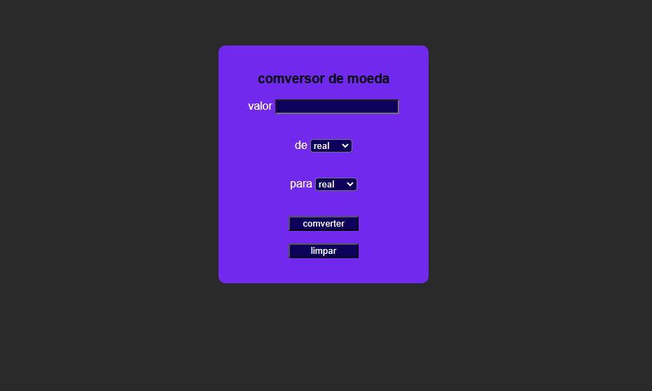

# ⚜️ simulador moedas API ⚜️

  

# 🔰 imagemdo projeto 🔰

# 🔰 resumo do projeto 🔰
 este projeto se trata de uma versão melhorada do projeto de nome conversor de moedas simples 
o qual vou deixar em  anexo aqui [Link pelo git pages](https://felipesg123.github.io/conversorDeMoedasimples/) 
o link par ver o projeto e aqui o link do arquvo no git ([Link do projeto](https://github.com/felipesg123/conversorDeMoedasimples)

# ⚜️ API utilizada ⚜️

# 🔰 exchangerate para a comversao de moedas 🔰
  foi utilizada a  API de conversão de moedas da exchangerate 
foi necessário para isso criar uma conta na exchangerate pois com ela 
pude ter o acesso a API foi  necessário pois a exchangerate só libera 
o acesso da API por meio de um id que de tempos em tempo vem com a 
necessidade de ir o trocando o id é enviado por e-mail e com isso 
abaixo um print do email que a exchangerate manda para informar que o 
id de acesso

# ⚜️ tecnologias aplicadas ⚜️

 - html 5 
 - css 3
 - js 
 - api 

 # 🔰 resumo das tecnologias aplicadas 🔰
  - o  html 5 e o js e o css 3 foram para fazes o back end e front end e a estilisação  da pagina e a comunicasão do site
 com a API da exchangerate de modo que todos os campos efetuam a sua função no css foi feito a estilização da página

# funsionalidade
**fazer a comverção de moedas;** o Projeto acessa por meio de meu acesso a api da  [exchangerate API](https://www.exchangerate-api.com/) para
fazer a comverção das moedas 

# fontes consultadas 
1 **exchengerete:** para a comverção
2 **:**

# 